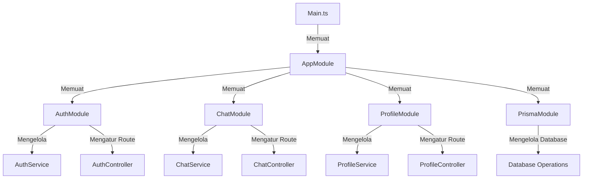
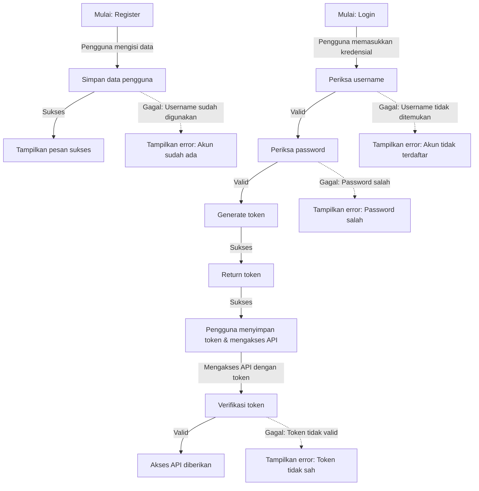

# LAPORAN LAB BACKEND NEST.JS

## 1.PENDAHULUAN
Proyek Lab Backend ini merupakan implementasi sistem backend menggunakan framework **NestJS**, yang dirancang untuk memenuhi kebutuhan aplikasi modern dengan fitur-fitur seperti autentikasi, chat, profil mahasiswa, dan database dengan Prisma. Dalam proyek ini, kami akan membahas tentang bagaimana membangun aplikasi backend yang skalabel, aman, dan mudah dipelihara, serta bagaimana mengintegrasikan teknologi-teknologi seperti WebSockets dan JWT untuk menyediakan komunikasi real-time dan autentikasi pengguna yang aman. Dengan menggunakan contoh-contoh kode yang disediakan, Anda dapat mempelajari bagaimana menerapkan konsep-konsep ini dalam proyek Anda sendiri.

## 2. STRUKTUR PROYEK

Berikut ini adalah struktur proyek **Lab-NestJS**:
```
📦lab-nestjs/
├── 📂node_modules/
├── 📂prisma/
│   ├── prisma.schema
├── 📂public/
│   ├── 🟨app.js
│   ├── 🟧index.html
│   ├── 🟦styles.css
├── 📂src/
│   ├── 📂chat/
│   |   |-- chat.gateaway.spec.ts
│   |   |-- chat.gateaway.ts
│   |   |-- chat.module.ts
│   |   |-- chat.service.spec.ts
│   |   |-- chat.service.ts
│   ├── 📂dto/
│   |   |-- create-mahasiswa.dto.ts
│   |   |-- register-user.dto.ts
│   ├── 📂entity/
│   |   |-- user.entity.ts
│   ├── 📂mahasiswa-profile/
│   |   |-- mahasiswa-profile.controller.spec.ts
│   |   |-- mahasiswa-profile.controller.ts
│   |   |-- mahasiswa-profile.module.ts
│   |   |-- mahasiswa-profile.service.spec.ts
│   |   |-- mahasiswa-profile.service.ts
│   ├── 📂profile/
│   |   |-- profile.controller.spec.ts
│   |   |-- profile.controller.ts
│   |   |-- profile.module.ts
│   |   |-- profile.service.spec.ts
│   |   |-- profile.service.ts
│   |-- app.controller.spec.ts
│   |-- app.controller.ts
│   |-- app.module.ts
│   |-- app.service.ts
│   |-- auth.guard.ts
│   |-- auth.module.ts
│   |-- 🟦main.ts
│   |-- 🟦prisma.ts
│   |-- 🟦user.decorator.ts
├── 📂test/
├── 📂uploads/
├── .env
├── .gitignore
├── .prettierrc
├── nest-cli.json
├── package-lock.json 
├── package.json 
├── README.md 
├── tsconfig.build.json 
├── tsconfig.json 
```

---
## 3. TEKNOLOGI YANG DIGUNAKAN
|Nama|Deskripsi|
|---|---|
|`NestJS`|Framework backend berbasis TypeScript|
|`TypeScript`|Sebagai bahasa pemrograman yang digunakan untuk membuat kode proyek.
|`Prisma`|ORM untuk database.
|`PostgreSQL`|Sebagai database yang digunakan dalam proyek.
|`Swagger`|Sebagai library untuk mengimplementasikan dokumentasi API menggunakan Swagger.
|`WebSockets`|Untuk komunikasi real-time dalam chat.
|`Socket.io`|Sebagai library untuk mengimplementasikan WebSocket.
|`JWT (JSON Web Token)`|Untuk autentikasi pengguna.
---
## 4. INSTALASI PROYEK NEST.JS
1. **Install NestJS CLI**
   ```sh
   npm i -g @nestjs/cli
   ```
2. **Inisialisasi Proyek NestJS**
   ```sh
   nest new nama_proyek
   ```
3. **Masuk Direktori**
   ```sh
   cd nama_proyek
   ```
4. **Setup Swagger**
   ```sh
   npm i –save @nestjs/swagger
   ```
5. **Buka Folder di VSCODE**
   ```sh
   code .
   ```

## 5. PENJELASAN SETIAP FILE
### 1. `prisma/schema.prisma`
File ini berisi definisi model dan enum yang digunakan dalam aplikasi. Berikut adalah penjelasan setiap bagian:

#### a. **Model `Mahasiswa`**
Model ini mendefinisikan tabel untuk menyimpan data mahasiswa dengan kolom-kolom berikut:
- `nim`: Nomor Induk Mahasiswa (NIM)
- `nama`: Nama lengkap mahasiswa
- `kelas`: Kelas tempat mahasiswa bernaung
- `jurusan`: Jurusan yang diambil oleh mahasiswa
- `jenis_kelamin`: Jenis kelamin mahasiswa (Laki-laki / Perempuan)
- `foto_profile`: Foto profil mahasiswa (opsional)

#### b. **Enum `Jenis_Kelamin`**
Enum ini mendefinisikan dua nilai yang valid untuk jenis kelamin mahasiswa:
- `L`: Laki-laki
- `P`: Perempuan

#### c. **Model `User`**
Model ini mendefinisikan tabel untuk menyimpan data pengguna aplikasi dengan kolom-kolom berikut:
- `id`: ID unik pengguna
- `username`: Nama pengguna yang digunakan untuk login
- `password`: Kata sandi pengguna
- `role`: Peran pengguna (ADMIN atau USER)
- `foto_profile`: Foto profil pengguna (opsional)

#### d. **Enum `Role`**
Enum ini mendefinisikan dua peran pengguna yang ada dalam aplikasi:
- `ADMIN`: Pengguna dengan akses penuh ke sistem
- `USER`: Pengguna dengan akses terbatas sesuai peran
2. **src/prisma.ts**
3. **src/user.decorator.ts**
---
### 2. `chat/chat.gateway.spec.ts`
File ini berisi unit test untuk **`ChatGateway`** menggunakan framework **NestJS testing**. Tujuan dari file ini adalah untuk memastikan bahwa **ChatGateway** berfungsi dengan baik.

#### a. **Impor Modul dan Layanan:**
   - `Test`, `TestingModule`: Digunakan untuk membuat dan mengonfigurasi modul pengujian di NestJS.
   - `ChatGateway`: Gateway yang akan diuji.
   - `ChatService`: Layanan yang digunakan oleh **ChatGateway**.

#### b. **Setup Pengujian:**
   - `beforeEach`: Sebelum setiap tes, sebuah modul pengujian dibuat dan dikompilasi. Di dalamnya, **ChatGateway** dan **ChatService** didaftarkan sebagai penyedia.
   - `gateway`: Menyimpan instance dari **ChatGateway** yang siap diuji.

#### c. **Unit Test:**
   - `it('should be defined', ...)`: Memastikan bahwa instance **ChatGateway** telah terdefinisi setelah modul pengujian dibuat dan dikompilasi.
---
### 3. `chat/chat.gateway.ts`
File ini mendefinisikan **WebSocket Gateway** untuk aplikasi chat menggunakan **Socket.IO**:

#### a. **Dekorator `@WebSocketGateway()`**
Dekorator ini mengonfigurasi WebSocket Gateway dengan pengaturan CORS (mengizinkan akses dari semua domain) dan path untuk koneksi WebSocket yaitu `/socket`.

#### b. **Properti `server`**
Menggunakan dekorator `@WebSocketServer()` untuk mendeklarasikan instance **Socket.IO Server** yang digunakan untuk mengirimkan pesan ke semua klien yang terhubung.

#### c. **Manajemen Pengguna**
Data pengguna disimpan dalam map `users` yang memetakan ID socket ke objek yang berisi `username` dan `room`.

#### d. **Fungsi `handleConnection()`**
Menangani koneksi baru ke WebSocket server. ID pengguna yang baru terhubung dicetak di log.

#### e. **Fungsi `handleDisconnect()`**
Menangani pemutusan koneksi dari pengguna. Jika pengguna terhubung ke suatu room, mereka akan dikeluarkan dari room tersebut, dan pesan dikirimkan ke room untuk memberitahukan bahwa pengguna telah keluar.

#### f. **Fungsi `handleJoinRoom()`**
Menangani permintaan untuk bergabung ke room chat tertentu. Fungsi ini memvalidasi `username` dan `room`, kemudian menambahkan pengguna ke dalam room. Pesan akan dikirim ke semua pengguna di room yang memberitahukan bahwa pengguna baru telah bergabung.

#### g. **Fungsi `handleLeaveRoom()`**
Menangani permintaan untuk meninggalkan room. Fungsi ini akan mengeluarkan pengguna dari room yang diikuti dan mengirimkan pesan ke semua pengguna di room bahwa pengguna telah meninggalkan room.

#### h. **Fungsi `handleRoomMessage()`**
Menangani pengiriman pesan dalam room tertentu. Jika `username`, `room`, dan `message` valid, pesan akan disiarkan ke semua pengguna di room tersebut.

---
### 4. `chat/chat.module.ts`
File ini mendefinisikan **ChatModule**, yang merupakan modul utama untuk bagian chat dalam aplikasi.

#### a. **Dekorator `@Module()`**
Dekorator ini digunakan untuk mendeklarasikan sebuah modul di NestJS. Dalam hal ini, modul **ChatModule** berfungsi untuk mengelompokkan provider terkait chat, yaitu:
- **`ChatService`**: Layanan yang mengelola logika bisnis untuk aplikasi chat.
- **`ChatGateway`**: WebSocket gateway yang menangani koneksi real-time dan komunikasi antar pengguna dalam room chat.

#### b. **Providers**
Modul ini menyediakan **`ChatGateway`** dan **`ChatService`** sebagai bagian dari dependensi yang akan disuntikkan ke dalam kelas lain yang membutuhkan layanan ini.

---
### 5. `chat/chat.service.spec.ts`
File ini berisi unit test untuk **`ChatService`**. Tujuan dari file ini adalah untuk memastikan bahwa **ChatService** berfungsi dengan benar dan terdefinisi dengan baik.

#### a. **Impor Modul dan Layanan:**
   - `Test`, `TestingModule`: Digunakan untuk membuat dan mengonfigurasi modul pengujian di NestJS.
   - `ChatService`: Layanan yang diuji dalam file ini.

#### b. **Setup Pengujian:**
   - `beforeEach`: Sebelum setiap pengujian, sebuah modul pengujian dibuat dan dikompilasi. Di dalam modul ini, **ChatService** didaftarkan sebagai provider.
   - `service`: Menyimpan instance dari **ChatService** yang siap diuji.

#### c. **Unit Test:**
   - `it('should be defined', ...)`: Menguji bahwa **ChatService** telah terdefinisi dengan benar setelah modul pengujian dibuat dan dikompilasi. Tes ini memastikan bahwa **ChatService** diinisialisasi dengan baik.

---
### 6. `dto/create-mahasiswa.dto.ts`
File ini berisi definisi **Data Transfer Object (DTO)** untuk membuat data mahasiswa baru. DTO ini digunakan untuk validasi dan mendokumentasikan struktur data yang diterima melalui API.

#### a. **Dekorator `@ApiProperty()`**
Dekorator ini digunakan untuk mendokumentasikan properti pada DTO menggunakan **Swagger**, sehingga API dapat menghasilkan dokumentasi yang jelas mengenai tipe dan contoh data yang diharapkan.

#### b. **Properti pada DTO:**
1. **`nim` (NIM Mahasiswa)**
   - Tipe data: `string`
   - Validasi:
     - Harus berupa string (`@IsString`).
     - Tidak boleh kosong (`@IsNotEmpty`).
     - Panjangnya antara 1 sampai 12 karakter (`@Length(1, 12)`).
   - Deskripsi: Menyimpan Nomor Induk Mahasiswa.

2. **`nama` (Nama Mahasiswa)**
   - Tipe data: `string`
   - Validasi:
     - Harus berupa string (`@IsString`).
     - Tidak boleh kosong (`@IsNotEmpty`).
     - Panjangnya antara 1 sampai 50 karakter (`@Length(1, 50)`).
   - Deskripsi: Menyimpan nama lengkap mahasiswa.

3. **`Kelas`**
   - Tipe data: `string`
   - Validasi:
     - Harus berupa string (`@IsString`).
     - Tidak boleh kosong (`@IsNotEmpty`).
     - Panjangnya antara 1 sampai 2 karakter (`@Length(1, 2)`).
   - Deskripsi: Menyimpan kelas tempat mahasiswa bernaung.

4. **`jurusan` (Jurusan Mahasiswa)**
   - Tipe data: `string`
   - Validasi:
     - Harus berupa string (`@IsString`).
     - Tidak boleh kosong (`@IsNotEmpty`).
     - Panjangnya antara 1 sampai 12 karakter (`@Length(1, 12)`).
   - Deskripsi: Menyimpan jurusan yang diambil mahasiswa.

5. **`jenis_kelamin` (Jenis Kelamin Mahasiswa)**
   - Tipe data: `Jenis_Kelamin` (Enum yang berasal dari Prisma)
   - Validasi:
     - Harus berupa nilai enum (`@IsEnum`), dengan nilai yang valid hanya `L` atau `P`.
   - Deskripsi: Menyimpan jenis kelamin mahasiswa yang hanya bisa bernilai `L` (Laki-laki) atau `P` (Perempuan).

---
### 7. `dto/register-user.dto.ts`
File ini berisi definisi **Data Transfer Object (DTO)** untuk mendaftarkan pengguna baru dalam aplikasi. DTO ini digunakan untuk memvalidasi dan mendokumentasikan data pengguna yang diterima melalui API.

#### - **Dekorator `@ApiProperty()`**
Dekorator ini digunakan untuk mendokumentasikan properti dalam DTO menggunakan **Swagger**, untuk menghasilkan dokumentasi API yang jelas mengenai tipe dan contoh data yang diharapkan.

#### a. **Properti pada DTO:**
1. **`username` (Nama Pengguna)**
   - Tipe data: `string`
   - Validasi:
     - Harus berupa string (`@IsString`).
     - Tidak boleh kosong (`@IsNotEmpty`).
     - Tidak boleh mengandung spasi (validasi menggunakan `@Matches(/^\S*$/i)` untuk memastikan hanya karakter non-spasi).
     - Panjangnya antara 1 hingga 30 karakter (`@Length(1, 30)`).
   - Deskripsi: Menyimpan nama pengguna yang digunakan untuk login ke aplikasi.

2. **`password` (Kata Sandi)**
   - Tipe data: `string`
   - Validasi:
     - Harus berupa string (`@IsString`).
     - Tidak boleh kosong (`@IsNotEmpty`).
     - Tidak boleh mengandung spasi (validasi menggunakan `@Matches(/^\S*$/i)` untuk memastikan hanya karakter non-spasi).
     - Panjangnya antara 1 hingga 30 karakter (`@Length(1, 30)`).
   - Deskripsi: Menyimpan kata sandi yang digunakan untuk login ke aplikasi.

---
### 8. `entity/user.entity.ts`
File ini berisi definisi **Entity** untuk pengguna dalam aplikasi, yang digunakan untuk memetakan data pengguna ke dalam objek yang dapat digunakan oleh aplikasi. Entity ini juga menggunakan **class-transformer** untuk mengatur properti mana yang akan diekspos dan disembunyikan saat data pengguna diproses.

#### a. **Properti pada Entity:**
1. **`id` (ID Pengguna)**
   - Tipe data: `number`
   - Deskripsi: Menyimpan ID unik pengguna yang terdaftar dalam sistem.
   - Dekorator `@Expose()`: Menandakan bahwa properti ini akan diekspos dalam proses serialisasi objek.

2. **`username` (Nama Pengguna)**
   - Tipe data: `string`
   - Deskripsi: Menyimpan nama pengguna yang digunakan untuk login.
   - Dekorator `@Expose()`: Menandakan bahwa properti ini akan diekspos dalam proses serialisasi objek.

3. **`password` (Kata Sandi)**
   - Tipe data: `string`
   - Deskripsi: Menyimpan kata sandi pengguna (tidak akan diekspos untuk keamanan).
   - Dekorator `@Exclude()`: Menandakan bahwa properti ini tidak akan disertakan dalam proses serialisasi objek untuk mencegah kebocoran informasi sensitif.

4. **`role` (Peran Pengguna)**
   - Tipe data: `Role` (Enum dari Prisma)
   - Deskripsi: Menyimpan peran pengguna dalam aplikasi (misalnya, ADMIN atau USER).
   - Dekorator `@Expose()`: Menandakan bahwa properti ini akan diekspos dalam proses serialisasi objek.

5. **`foto_profile` (Foto Profil Pengguna)**
   - Tipe data: `string`
   - Deskripsi: Menyimpan URL atau nama file foto profil pengguna.
   - Dekorator `@Expose()`: Menandakan bahwa properti ini akan diekspos dalam proses serialisasi objek.
---
### 9. `mahasiswa-profile/mahasiswa-profile.controller.ts`
File ini berisi **Controller** untuk menangani API terkait pengelolaan foto profil mahasiswa, termasuk untuk meng-upload dan mengambil foto profil berdasarkan **NIM**.

#### a. **Dekorator `@Controller()`**
Dekorator ini mendefinisikan rute dasar untuk controller ini, yaitu `mahasiswa-profile`.

#### b. **Rute API:**

1. **`POST /mahasiswa-profile/upload`**  
   - Fungsi: Meng-upload foto profil mahasiswa.
   - Deskripsi: Endpoint ini menerima file foto profil dan **NIM** mahasiswa sebagai input. File tersebut akan disimpan menggunakan service `MahasiswaProfileService`.
   - **Dekorator:**
     - `@ApiOperation()`: Menyediakan deskripsi untuk dokumentasi Swagger.
     - `@ApiConsumes()`: Menentukan tipe konten yang diterima, yaitu `multipart/form-data` untuk file upload.
     - `@ApiBody()`: Menyediakan schema body untuk mendokumentasikan input API.
     - `@UseInterceptors()`: Menggunakan `FileInterceptor` untuk menangani file upload.
   - Validasi:
     - Jika file tidak ada, akan melemparkan **BadRequestException** dengan pesan "File tidak boleh kosong!".
     - Jika **NIM** tidak ada, akan melemparkan **BadRequestException** dengan pesan "NIM tidak boleh kosong!".
   - Menyerahkan pengolahan file ke service `mahasiswaProfileService.uploadFile()`.

2. **`GET /mahasiswa-profile/:nim`**  
   - Fungsi: Mengambil foto profil mahasiswa berdasarkan **NIM**.
   - Deskripsi: Endpoint ini mencari foto profil yang terasosiasi dengan **NIM** mahasiswa yang diberikan, kemudian mengirimkan file tersebut ke klien.
   - **Dekorator:**
     - `@ApiOperation()`: Menyediakan deskripsi untuk dokumentasi Swagger.
   - Validasi:
     - Jika foto profil tidak ditemukan untuk **NIM** yang diberikan, maka akan melemparkan **NotFoundException** dengan pesan "Foto profil tidak ditemukan!".
     - Jika file tidak ditemukan di server, maka akan melemparkan **NotFoundException** dengan pesan "File tidak ditemukan di server".
   - File profil diambil dari server menggunakan `sendMyFotoProfile()` dari `mahasiswaProfileService` dan dikirim ke klien menggunakan `res.sendFile()`.
---
### 10. `mahasiswa-profile/mahasiswa-profile.service.ts`
File ini berisi **Service** yang menangani logika bisnis terkait pengelolaan foto profil mahasiswa, termasuk meng-upload foto dan mengambil foto profil berdasarkan **NIM** mahasiswa.

#### a. **Metode `uploadFile()`**
Fungsi ini bertanggung jawab untuk meng-upload foto profil mahasiswa ke server dan memperbarui informasi foto profil di database.

1. **Langkah-langkah:**
   - Mengambil data mahasiswa berdasarkan **NIM** yang diberikan.
   - Jika mahasiswa tidak ditemukan, melemparkan **NotFoundException**.
   - Memastikan direktori `uploads` ada, jika belum maka membuatnya.
   - Menyusun nama file unik dengan menggunakan **NIM** mahasiswa, timestamp, dan ekstensi file.
   - Menulis file yang diterima ke dalam direktori `uploads`.
   - Memperbarui field `foto_profile` pada data mahasiswa di database dengan nama file yang baru.

2. **Validasi:**
   - Jika mahasiswa dengan **NIM** yang diberikan tidak ditemukan, melemparkan **NotFoundException** dengan pesan "User tidak ditemukan!".

3. **Output:**
   - Mengembalikan objek yang berisi nama file dan path file yang disimpan di server.

#### b. **Metode `sendMyFotoProfile()`**
Fungsi ini bertanggung jawab untuk mengembalikan nama file foto profil mahasiswa berdasarkan **NIM** yang diberikan.

1. **Langkah-langkah:**
   - Mencari data mahasiswa berdasarkan **NIM** yang diberikan.
   - Jika mahasiswa tidak ditemukan atau tidak memiliki foto profil, melemparkan **NotFoundException** dengan pesan "Foto profil tidak ditemukan".
   - Mengembalikan nama file foto profil mahasiswa.

2. **Validasi:**
   - Jika mahasiswa dengan **NIM** yang diberikan tidak ditemukan atau tidak memiliki foto profil, melemparkan **NotFoundException** dengan pesan "Foto profil tidak ditemukan".
---
### 11. `profile/profile.controller.ts`
File ini berisi **Controller** untuk menangani API terkait pengelolaan foto profil pengguna. Controller ini berfungsi untuk meng-upload dan mengambil foto profil pengguna menggunakan **NestJS**.

#### a. **Rute API:**

1. **`POST /profile/upload`**
   - Fungsi: Meng-upload foto profil pengguna.
   - Deskripsi: Endpoint ini menerima file foto profil yang akan di-upload. File disertakan dalam body permintaan dan diproses menggunakan **Multer**.
   - **Dekorator:**
     - `@UseInterceptors(FileInterceptor('file'))`: Menggunakan interceptor untuk menangani upload file.
   - Validasi:
     - Jika tidak ada file yang di-upload, akan melemparkan **BadRequestException** dengan pesan "File tidak boleh kosong!!".
   - Fungsi ini memanggil `profileService.uploadFile()` untuk menangani proses upload dan menyimpan file.

2. **`GET /profile/:id`**
   - Fungsi: Mengambil foto profil pengguna berdasarkan **ID** pengguna.
   - Deskripsi: Endpoint ini mengembalikan file foto profil pengguna berdasarkan **ID** yang diberikan dalam parameter URL. Foto profil diambil dari folder `uploads` dan dikirimkan ke klien.
   - Validasi:
     - Fungsi ini memanggil `profileService.sendMyFotoProfile()` untuk mengambil nama file foto profil berdasarkan **ID** pengguna, dan mengembalikannya ke klien.
   - Menggunakan `@Res()` untuk mengirim file gambar ke pengguna menggunakan **express**.
---


---

---

## 6. DIAGRAM ARSITEKTUR

Berikut diagram arsitektur proyek dalam bentuk flowchart visual:


Diagram ini menunjukkan bagaimana modul saling terhubung dan bagaimana aliran data terjadi di dalam aplikasi **Lab-NestJS**.

## 7. ALUR KERJA REGISTER USER, LOGIN DAN AUTHENTICATION



## 8. CARA MENJALANKAN PROYEK

1. **Clone repository:**
   ```sh
   git clone <repo-url>
   cd lab-nestjs
   ```

2. **Install dependencies:**
   ```sh
   npm install
   ```

3. **Menjalankan server:**
   ```sh
   npm start
   npm run start:dev
   ```

4. **Akses API di:**
   ```sh
   http://localhost:3000
   http://localhost:3000/api-docs  --> Swagger
   ```


## 9. KESIMPULAN
Proyek ini adalah implementasi backend menggunakan NestJS dengan beberapa modul utama, termasuk autentikasi, chat, profil mahasiswa, dan database dengan Prisma. Dengan menggunakan teknologi seperti WebSockets dan JWT, proyek ini dapat menyediakan komunikasi real-time dan autentikasi pengguna yang aman.