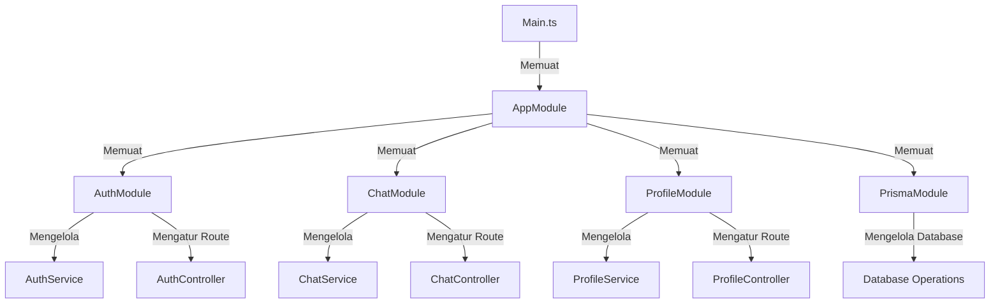
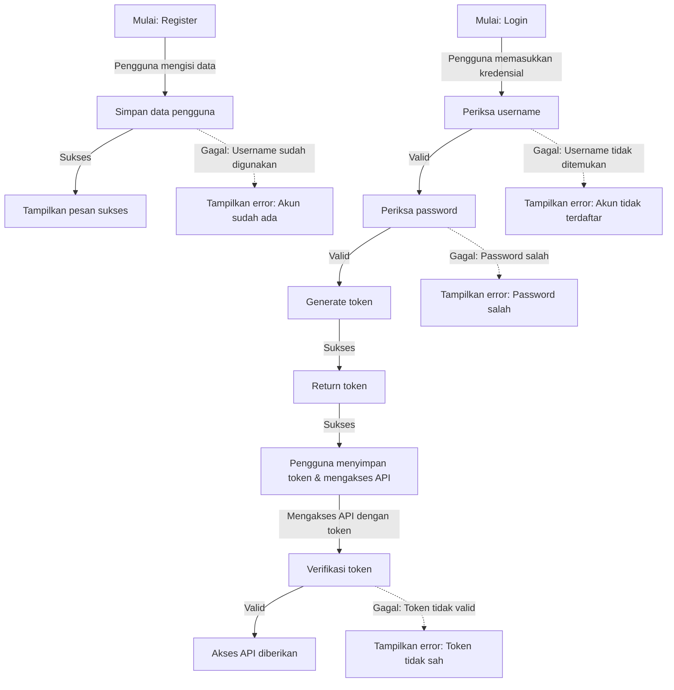

# Lab NestJS

Proyek ini adalah implementasi backend menggunakan **NestJS** dengan beberapa modul utama, termasuk autentikasi, chat, profil mahasiswa, dan database dengan Prisma.

## Struktur Proyek

Berikut adalah struktur proyek **Lab-NestJS** yang lebih rapi dan mudah dipahami:

```
📦lab-nestjs/
├── 📂prisma/
│   ├── prisma.schema
├── 📂public/
│   ├── 🟨app.js
│   ├── 🟧index.html
│   ├── 🟦styles.css
├── 📂src/
│   ├── 📂chat/
│   |   |-- chat.gateaway.spec.ts
│   |   |-- chat.gateaway.ts
│   |   |-- chat.module.ts
│   |   |-- chat.service.spec.ts
│   |   |-- chat.service.ts
│   ├── 📂dto/
│   |   |-- create-mahasiswa.dto.ts
│   |   |-- register-user.dto.ts
│   ├── 📂entity/
│   |   |-- user.entity.ts
│   ├── 📂mahasiswa-profile/
│   |   |-- mahasiswa-profile.controller.spec.ts
│   |   |-- mahasiswa-profile.controller.ts
│   |   |-- mahasiswa-profile.module.ts
│   |   |-- mahasiswa-profile.service.spec.ts
│   |   |-- mahasiswa-profile.service.ts
│   ├── 📂profile/
│   |   |-- profile.controller.spec.ts
│   |   |-- profile.controller.ts
│   |   |-- profile.module.ts
│   |   |-- profile.service.spec.ts
│   |   |-- profile.service.ts
│   |-- app.controller.spec.ts
│   |-- app.controller.ts
│   |-- app.module.ts
│   |-- app.service.ts
│   |-- auth.guard.ts
│   |-- auth.module.ts
│   |-- 🟦main.ts
│   |-- 🟦prisma.ts
│   |-- 🟦user.decorator.ts
├── 📂test/
├── 📂uploads/
├── .env
├── .gitignore
├── .prettierrc
├── nest-cli.json
├── package-lock.json 
├── package.json 
├── README.md 
├── tsconfig.build.json 
├── tsconfig.json 
```

## Diagram Arsitektur

Berikut adalah diagram arsitektur proyek dalam bentuk flowchart yang lebih visual:



Diagram ini menunjukkan bagaimana modul saling terhubung dan bagaimana aliran data terjadi di dalam aplikasi **Lab-NestJS**.

## Alur Kerja Register User, Login dan Authenticated



## Cara Menjalankan Proyek

1. **Clone repository:**
   ```sh
   git clone <repo-url>
   cd lab-nestjs
   ```

2. **Install dependencies:**
   ```sh
   npm install
   ```

3. **Menjalankan server:**
   ```sh
   npm run start
   npm run start:dev
   ```

4. **Akses API di:**
   ```sh
   http://localhost:3000
   ```

## Teknologi yang Digunakan
- **NestJS** → Framework backend berbasis TypeScript.
- **Prisma** → ORM untuk database.
- **WebSockets** → Untuk komunikasi real-time dalam chat.
- **JWT (JSON Web Token)** → Untuk autentikasi pengguna.

## Kesimpulan
Proyek ini adalah implementasi backend menggunakan NestJS dengan beberapa modul utama, termasuk autentikasi, chat, profil mahasiswa, dan database dengan Prisma. Dengan menggunakan teknologi seperti WebSockets dan JWT, proyek ini dapat menyediakan komunikasi real-time dan autentikasi pengguna yang aman.