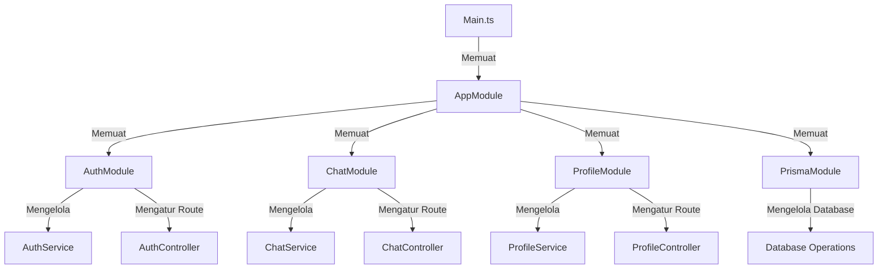

# Lab NestJS

Proyek ini adalah implementasi backend menggunakan **NestJS** dengan beberapa modul utama, termasuk autentikasi, chat, profil mahasiswa, dan database dengan Prisma.

## Struktur Proyek

Berikut adalah struktur proyek **Lab-NestJS** yang lebih rapi dan mudah dipahami:

```
lab-nestjs/
├── src/
│   ├── app/
│   │   ├── app.module.ts     # Modul utama aplikasi
│   │   ├── app.controller.ts # Kontroler utama
│   │   ├── app.service.ts    # Layanan utama
│   ├── auth/
│   │   ├── auth.module.ts    # Modul autentikasi
│   │   ├── auth.controller.ts # Kontroler autentikasi
│   │   ├── auth.service.ts   # Layanan autentikasi
│   ├── chat/
│   │   ├── chat.module.ts    # Modul chat
│   │   ├── chat.controller.ts # Kontroler chat
│   │   ├── chat.service.ts   # Layanan chat
│   ├── mahasiswa-profile/
│   │   ├── mahasiswa-profile.module.ts # Modul profil mahasiswa
│   │   ├── mahasiswa-profile.controller.ts # Kontroler profil mahasiswa
│   │   ├── mahasiswa-profile.service.ts # Layanan profil mahasiswa
│   ├── profile/
│   │   ├── profile.module.ts # Modul profil umum
│   │   ├── profile.controller.ts # Kontroler profil
│   │   ├── profile.service.ts # Layanan profil
│   ├── prisma/
│   │   ├── prisma.module.ts  # Modul Prisma untuk database
│   │   ├── prisma.service.ts # Layanan Prisma
│   ├── dto/
│   │   ├── create-mahasiswa.dto.ts  # DTO untuk mahasiswa
│   │   ├── register-user.dto.ts  # DTO untuk registrasi user
│   ├── entity/
│   │   ├── user.entity.ts  # Definisi entitas pengguna
│   ├── main.ts  # Entry point aplikasi
├── public/
│   ├── app.js  # File publik
├── package.json  # Konfigurasi proyek
├── README.md  # Dokumentasi proyek
```

## Diagram Arsitektur

Berikut adalah diagram arsitektur proyek dalam bentuk flowchart yang lebih visual:



Diagram ini menunjukkan bagaimana modul saling terhubung dan bagaimana aliran data terjadi di dalam aplikasi **Lab-NestJS**.

## Cara Menjalankan Proyek

1. **Clone repository:**
   ```sh
   git clone <repo-url>
   cd lab-nestjs
   ```

2. **Install dependencies:**
   ```sh
   npm install
   ```

3. **Menjalankan server:**
   ```sh
   npm run start
   npm run start:dev
   ```

4. **Akses API di:**
   ```sh
   http://localhost:3000
   ```

## Teknologi yang Digunakan
- **NestJS** → Framework backend berbasis TypeScript.
- **Prisma** → ORM untuk database.
- **WebSockets** → Untuk komunikasi real-time dalam chat.
- **JWT (JSON Web Token)** → Untuk autentikasi pengguna.
